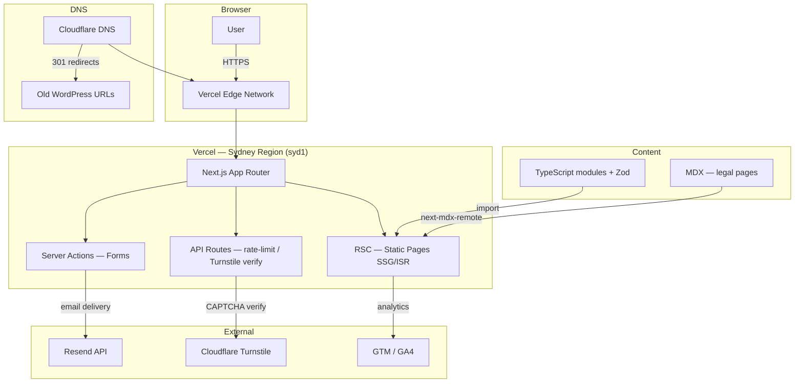

# Phase 2 — Technical Requirements Document (TRD)
**Project:** Maxwell Financial Services Ltd — Website Rebuild  
**Version:** 1.0 — Approval Draft  
**Date:** October 2026

---

## 1. Architecture Overview



**Key architectural decisions:**
- **Static-first**: all 15 pages are SSG. No ISR needed for v1 (content changes via PR, not CMS).
- **Server Components by default**: only forms and the cookie modal are Client Components.
- **Server Actions for forms**: no API routes for form handling — avoids CORS, co-locates validation.
- **No database**: no user accounts, no sessions, no data persistence beyond form emails.
- **Edge-friendly**: all pages are fully pre-rendered; Vercel Edge Network serves static assets.

---

## 2. Folder Structure & Naming Conventions

```
/
├── DESIGN.md
├── docs/
│   ├── 00-audit.md
│   ├── 01-PRD.md
│   ├── 02-TRD.md
│   └── adr/
│       ├── ADR-001-nextjs-app-router.md
│       ├── ADR-002-tailwind-v4.md
│       ├── ADR-003-typescript-content-modules.md
│       ├── ADR-004-resend-email.md
│       ├── ADR-005-no-site-search.md
│       ├── ADR-006-cms-migration-path.md
│       └── ADR-007-cloudflare-turnstile.md
├── src/
│   ├── app/
│   │   ├── layout.tsx               # Root layout — font, GTM, skip link, cookie modal
│   │   ├── page.tsx                 # Homepage (/)
│   │   ├── not-found.tsx            # 404
│   │   ├── sitemap.ts               # Dynamic sitemap
│   │   ├── robots.ts                # robots.txt
│   │   ├── life-insurance/
│   │   │   └── page.tsx
│   │   ├── trauma-insurance/
│   │   │   └── page.tsx
│   │   ├── income-protection/
│   │   │   └── page.tsx
│   │   ├── permanent-disability-insurance/
│   │   │   └── page.tsx
│   │   ├── health-insurance/
│   │   │   └── page.tsx
│   │   ├── home-insurance/
│   │   │   └── page.tsx
│   │   ├── car-insurance/
│   │   │   └── page.tsx
│   │   ├── contents-insurance/
│   │   │   └── page.tsx
│   │   ├── business-insurance/
│   │   │   └── page.tsx
│   │   ├── about/
│   │   │   └── page.tsx
│   │   ├── testimonials/
│   │   │   └── page.tsx
│   │   ├── disclosure-statement/
│   │   │   └── page.tsx
│   │   ├── privacy-policy/
│   │   │   └── page.tsx
│   │   ├── contact/
│   │   │   └── page.tsx
│   │   └── dev/
│   │       └── styleguide/
│   │           └── page.tsx         # noindex, excluded from sitemap
│   ├── components/
│   │   ├── ui/                      # Primitives
│   │   │   ├── Button.tsx
│   │   │   ├── Input.tsx
│   │   │   ├── Textarea.tsx
│   │   │   ├── Select.tsx
│   │   │   ├── Checkbox.tsx
│   │   │   ├── Tag.tsx
│   │   │   ├── Card.tsx
│   │   │   ├── Container.tsx
│   │   │   ├── Section.tsx
│   │   │   ├── Heading.tsx
│   │   │   └── Icon.tsx
│   │   ├── layout/
│   │   │   ├── TopBanner.tsx
│   │   │   ├── Header.tsx
│   │   │   ├── MegaNav.tsx
│   │   │   ├── MobileDrawer.tsx     # Client Component
│   │   │   ├── Footer.tsx
│   │   │   └── Breadcrumbs.tsx
│   │   ├── sections/
│   │   │   ├── HeroPanel.tsx
│   │   │   ├── ProductGrid.tsx
│   │   │   ├── ProductCard.tsx
│   │   │   ├── ProcessSteps.tsx
│   │   │   ├── CallbackForm.tsx     # Client Component
│   │   │   ├── QuoteForm.tsx        # Client Component
│   │   │   ├── AdviserCard.tsx
│   │   │   ├── PartnerLogos.tsx
│   │   │   ├── TestimonialsList.tsx
│   │   │   ├── CTABand.tsx
│   │   │   ├── TowerCTAModule.tsx
│   │   │   ├── FAQ.tsx              # Client Component (accordion)
│   │   │   └── ProseLegal.tsx
│   │   └── seo/
│   │       ├── SkipLink.tsx
│   │       ├── JsonLd.tsx
│   │       ├── Analytics.tsx        # Client Component — consent-gated GTM
│   │       └── CookieModal.tsx      # Client Component
│   ├── content/
│   │   ├── site-config.ts
│   │   ├── products.ts
│   │   ├── process-steps.ts
│   │   ├── partners.ts
│   │   ├── testimonials.ts
│   │   ├── advisers.ts
│   │   ├── nav-config.ts
│   │   └── legal/
│   │       ├── disclosure-statement.mdx
│   │       └── privacy-policy.mdx
│   ├── lib/
│   │   ├── env.ts                   # typed env vars (t3-env or manual zod)
│   │   ├── schemas.ts               # Zod schemas for all content modules
│   │   ├── analytics.ts             # GTM dataLayer helpers
│   │   ├── email.ts                 # Resend client + email templates
│   │   ├── rate-limit.ts            # IP-based rate limiter (Vercel KV or in-memory)
│   │   └── utils.ts                 # cn(), formatPhone(), etc.
│   ├── styles/
│   │   └── globals.css              # @theme tokens + base styles
│   └── actions/
│       ├── submit-callback.ts       # Server Action — callback form
│       └── submit-enquiry.ts        # Server Action — contact/quote form
├── public/
│   ├── images/                      # Downloaded from WP CDN
│   └── favicon.ico
├── tests/
│   ├── unit/
│   │   └── schemas.test.ts
│   ├── e2e/
│   │   ├── homepage.spec.ts
│   │   ├── contact-form.spec.ts
│   │   └── callback-form.spec.ts
│   └── a11y/
│       └── axe.spec.ts
├── .github/
│   └── workflows/
│       └── ci.yml
├── next.config.ts
├── tailwind.config.ts               # For tooling only; @theme lives in globals.css
├── .env.example
├── package.json
├── pnpm-lock.yaml
├── tsconfig.json
└── README.md
```

### Naming Conventions
- **Files**: `PascalCase` for components, `kebab-case` for pages/routes (Next.js convention), `camelCase` for lib/utils
- **CSS**: BEM-style class names where needed; prefer Tailwind utilities
- **Git branches**: `feature/FR-NNN-short-description`, `fix/description`, `chore/description`
- **Commits**: Conventional Commits (`feat:`, `fix:`, `chore:`, `docs:`, `test:`)

---

## 3. Design Token Implementation

### 3.1 globals.css — Tailwind v4 @theme block

```css
/* src/styles/globals.css */

@import "tailwindcss";

/* Replace KHTeka with Inter via next/font — exposed as --font-khteka so the
   licensed font can be dropped in later without touching any component. */

@theme {
  /* ── Colors ──────────────────────────────────────────────── */
  --color-electric-cobalt: #006cff;   /* Hero panels, filled buttons */
  --color-indigo-action:   #4672ff;   /* Primary interactive buttons */
  --color-deep-indigo:     #1b2045;   /* Primary text, headings */
  --color-sky-tint:        #66a7ff;   /* Hover states, outlined borders */
  --color-glacial-wash:    #cce2ff;   /* Tag fills, soft backgrounds */
  --color-parchment:       #f9f9f9;   /* Page canvas */
  --color-pure-white:      #ffffff;   /* Card surfaces, input fields */
  --color-mist:            #e9e9e9;   /* Hairline borders, dividers */
  --color-silver:          #bbbbbb;   /* Disabled states */
  --color-pewter:          #b3b3b3;   /* Shadow base, muted icons */
  --color-fog:             #9a9a9a;   /* BORDER/DISABLED ONLY — fails AA for body text */
  --color-steel:           #787878;   /* BORDER/PLACEHOLDER ONLY — fails AA for body text */
  --color-slate:           #6c6c6c;   /* BORDER/PLACEHOLDER ONLY — fails AA for body text */
  --color-graphite:        #4f4f4f;   /* Mid-tier body text — passes AA on white */
  --color-charcoal:        #303030;   /* Dark borders, footer dividers */
  --color-obsidian:        #202020;   /* Footer background, dark panels */
  --color-cobalt-radial:   #099ff0;   /* Luminous accent — blue panels only */

  /* ── Typography ──────────────────────────────────────────── */
  /* KHTeka substitute: Inter loaded via next/font, aliased as --font-khteka */
  --font-khteka:           var(--font-inter), ui-sans-serif, system-ui, sans-serif;
  --font-roboto:           ui-sans-serif, system-ui, sans-serif; /* modals/overlays */
  --font-khteka-mono:      ui-monospace, SFMono-Regular, Menlo, monospace; /* token present, not loaded */

  /* Type scale */
  --text-caption:          0.75rem;    /* 12px */
  --leading-caption:       1.43;
  --text-subheading:       1.125rem;   /* 18px */
  --leading-subheading:    1.4;
  --text-heading-sm:       1.25rem;    /* 20px */
  --leading-heading-sm:    1.33;
  --text-heading:          1.5rem;     /* 24px */
  --leading-heading:       1.2;
  --text-heading-lg:       1.875rem;   /* 30px */
  --leading-heading-lg:    1.11;
  --text-display:          2.25rem;    /* 36px */
  --leading-display:       1;

  /* Font weights */
  --font-weight-regular:   400;
  --font-weight-medium:    500;
  --font-weight-bold:      700;

  /* ── Spacing ─────────────────────────────────────────────── */
  --spacing-4:             0.25rem;
  --spacing-8:             0.5rem;
  --spacing-12:            0.75rem;
  --spacing-16:            1rem;
  --spacing-24:            1.5rem;
  --spacing-32:            2rem;
  --spacing-40:            2.5rem;
  --spacing-48:            3rem;
  --spacing-64:            4rem;
  --spacing-72:            4.5rem;

  /* ── Layout ──────────────────────────────────────────────── */
  --page-max-width:        75rem;      /* 1200px */
  --section-gap:           4rem;       /* 64px */
  --card-padding:          1.5rem;     /* 24px */
  --element-gap:           0.5rem;     /* 8px */

  /* ── Border Radius — THREE VALUES ONLY ───────────────────── */
  /* sm=tags/chips  2xl=controls  3xl=content surfaces          */
  --radius-sm:             0.1875rem;  /* 3px  — tags, chips */
  --radius-2xl:            1rem;       /* 16px — buttons, inputs, nav */
  --radius-3xl:            2.5rem;     /* 40px — cards, images, hero panels */

  /* ── Shadows — ONE shadow only ───────────────────────────── */
  --shadow-sm:             rgba(0,0,0,0.3) 0px 0px 8px 0px;
}

/* Base styles */
html {
  background-color: var(--color-parchment);
  color: var(--color-deep-indigo);
  font-family: var(--font-khteka);
}
```

### 3.2 Token → Tailwind Class Cheat Sheet

| Token | Tailwind class | Usage |
|---|---|---|
| `--color-electric-cobalt` | `bg-electric-cobalt`, `text-electric-cobalt` | Hero panels, filled buttons |
| `--color-deep-indigo` | `text-deep-indigo` | All headings and primary text |
| `--color-graphite` | `text-graphite` | Body/description text |
| `--color-parchment` | `bg-parchment` | Page background |
| `--color-pure-white` | `bg-pure-white` | Cards, inputs |
| `--color-mist` | `border-mist` | Card borders, dividers |
| `--color-obsidian` | `bg-obsidian` | Footer |
| `--radius-sm` | `rounded-sm` (custom) | Tags only |
| `--radius-2xl` | `rounded-2xl` | Buttons, inputs |
| `--radius-3xl` | `rounded-3xl` | Cards, hero panels |
| `--shadow-sm` | `shadow-sm` (custom) | Max one shadow per element |
| `--section-gap` | `py-[--section-gap]` | Section vertical padding |

### 3.3 Three-Radius Rule Enforcement

**Convention (documented, not automated for v1):**

> Only three radius values are permitted: `rounded-sm` (3px, tags), `rounded-2xl` (16px, controls), `rounded-3xl` (40px, content). Any PR adding `rounded-lg`, `rounded-xl`, `rounded-full` on card/section elements is rejected in code review.

**v2 automation option:** Add an ESLint plugin rule (custom) that flags non-permitted `rounded-*` utilities. Document this in the README.

### 3.4 Accessibility Override: Grey Text
`DESIGN.md` greys Fog (#9a9a9a), Steel (#787878), and Slate (#6c6c6c) **fail WCAG AA contrast** (4.5:1) for body text on white (#fff) and parchment (#f9f9f9) surfaces.

**Rule:**
- `--color-graphite` (#4f4f4f, contrast ratio 7.3:1 on white) — use for body copy, helper text, descriptions
- `--color-deep-indigo` (#1b2045) — use for headings and primary UI text
- `--color-fog`, `--color-steel`, `--color-slate` — **permitted only for**: borders, disabled state fills, placeholder text, decorative elements — **never for readable text**
- White text on Electric Cobalt (#006cff): contrast 4.6:1 — **passes AA** for large text (18px+) and bold UI elements; marginal for 16px/400 — use weight 500+ for all white text on cobalt at 16px

**Documented deviation from DESIGN.md:** Accessibility overrides design — per project rules. Noted here as the TRD's authoritative record.

---

## 4. Component Inventory

### 4.1 Primitives (`/src/components/ui/`)

#### `Button`
```typescript
type ButtonProps = {
  variant: 'filled' | 'outlined-dark' | 'ghost' | 'nav-pill';
  size?: 'sm' | 'md';        // md default
  href?: string;             // renders as <a> if provided
  loading?: boolean;
  disabled?: boolean;
  onClick?: () => void;
  children: React.ReactNode;
  className?: string;
};
```
| Variant | Background | Text | Border | Radius |
|---|---|---|---|---|
| `filled` | `--color-electric-cobalt` | white | none | `--radius-2xl` |
| `outlined-dark` | transparent | `--color-deep-indigo` | 1px `--color-deep-indigo` | `--radius-2xl` |
| `ghost` | transparent | `--color-deep-indigo` | none | none |
| `nav-pill` | `--color-electric-cobalt` | white | none | `--radius-2xl` |

States: hover (cobalt → sky-tint lightened 10%), focus-visible (3px offset ring in `--color-indigo-action`), disabled (silver bg, fog text), loading (spinner replaces text).

A11y: `aria-disabled` on disabled, `aria-busy` on loading, keyboard-activatable.

#### `Input`
```typescript
type InputProps = {
  id: string;            // required — label must reference this
  label: string;
  error?: string;
  required?: boolean;
  type?: 'text' | 'email' | 'tel';
  placeholder?: string;
  ...React.InputHTMLAttributes<HTMLInputElement>
};
```
Styling: `--radius-2xl`, `--color-mist` border (1px), `--color-pure-white` bg, `--color-deep-indigo` text, `--color-steel` placeholder. Error state: `--color-electric-cobalt` border tint → actually use red (#dc2626) for errors (WCAG error identification). Focus: 2px ring `--color-indigo-action`.

#### `Textarea`, `Select`, `Checkbox`
Same token system as Input. Checkbox uses `accent-color: var(--color-electric-cobalt)`.

#### `Tag`
`--radius-sm` (3px), `--color-glacial-wash` bg, `--color-deep-indigo` text at 12px/500. Inline, non-interactive label.

#### `Card`
Two size variants:
- `content-lg` — 40px radius, white bg, 1px mist border, 24px padding (large feature cards)
- `content-sm` — 16px radius, white bg, 1px mist border, 24px padding (info/text cards)

No box-shadow by default; use `shadow="sm"` prop only when card needs elevation from background.

#### `Container`
`max-w-[--page-max-width] mx-auto px-4 sm:px-6 lg:px-8` — always use this for content width.

#### `Section`
`py-[--section-gap]` wrapper. Optional `background` prop: `'canvas' | 'white' | 'brand' | 'dark'`.

#### `Heading`
Polymorphic: `as="h1"|"h2"|"h3"|"h4"`, `size="display"|"heading-lg"|"heading"|"heading-sm"|"subheading"`. Always `--color-deep-indigo`.

#### `Icon`
SVG wrapper. Props: `name`, `size` (16|20|24px default), `color` (deep-indigo default). Thin stroke (1.5px). Icons sourced from Heroicons (outline) — geometric, consistent with DESIGN.md spec.

---

### 4.2 Layout Components (`/src/components/layout/`)

#### `TopBanner`
```typescript
type TopBannerProps = {
  message: string;
  ctaText: string;
  ctaHref: string;
  dismissible?: boolean;
};
```
Full-width Electric Cobalt band, ~48px height, white text 14px/500, close button (dismissible). Stores dismissed state in `sessionStorage`. Server Component safe (state handled client-side via `'use client'` toggle).

#### `Header`
Server Component. Contains: logo `<Image>`, `<MegaNav>` (desktop), `<MobileDrawer>` (mobile), CTA `<Button variant="nav-pill">`. Sticky with `position: sticky; top: 0; z-index: 50`.

#### `MegaNav`
Desktop mega-nav. Products dropdown renders a `<ul>` with all 9 product links. Uses Radix `NavigationMenu` (headless, restyled). Keyboard: arrow keys navigate items, Esc closes.

#### `MobileDrawer`
Client Component. Radix `Dialog` (accessible modal drawer). Renders the full nav tree. Focus trap while open, Esc closes, focus returns to hamburger trigger.

#### `Footer`
Server Component. Dark Obsidian (#202020) band.

Sections (left to right):
1. Logo + short tagline
2. Products links (2-column grid)
3. Company links (About, Testimonials, Disclosure, Privacy, Contact)
4. Contact details (phone, email, address)

Bottom bar:
- **"Maxwell Financial Services Limited (FSP737512) holds a Class 2 Licence issued by the Financial Markets Authority to provide financial advice."** — // COMPLIANCE-REVIEW
- "Adviser: Roger Venkatesh (FSP 539026)"
- Links: Disclosure Statement | Privacy Policy
- © 2026 Maxwell Financial Services Ltd.

#### `Breadcrumbs`
Server Component. Accepts `items: { label: string; href: string }[]`. Renders `<nav aria-label="Breadcrumb"><ol>` with JSON-LD `BreadcrumbList` via `JsonLd`. Last item has `aria-current="page"`.

---

### 4.3 Section Components (`/src/components/sections/`)

#### `HeroPanel`
Electric Cobalt `--radius-3xl` panel, 48-64px internal padding. Props: `headline` (H1), `subtext`, `slot` (for TowerCTAModule or other content), `showRadialAccent?: boolean` (adds `--gradient-cobalt-radial` overlay in bottom-right — used sparingly).

#### `ProductGrid`
3-column responsive grid (1-col mobile, 2-col tablet, 3-col desktop). Maps `products[]` content module to `ProductCard`.

#### `ProductCard`
`content-lg` Card (40px radius, white bg, 1px mist). Children: image (40px radius, `next/image`), product name (H3, `--text-heading-sm`), blurb (graphite), "Learn More →" link. Hover: `--shadow-sm` lifts card.

#### `ProcessSteps`
6-step layout. Desktop: 2-row × 3-column grid. Mobile: single column. Each step: icon image, step number tag (3px radius, glacial wash), title (H3), body text. CTA button below grid linking to `/contact/`.

#### `CallbackForm`
**Client Component.** React Hook Form + Zod. Fields: `phone` (tel, required). Honeypot: `_honey` (visually hidden, aria-hidden). Turnstile widget rendered (calls Server Action to verify). On submit → `submitCallback` Server Action. States: idle, submitting, success, error.

```typescript
const callbackSchema = z.object({
  phone: z.string().regex(/^0[234578]\d{7,9}$/, 'Please enter a valid NZ phone number'),
  _honey: z.literal(''),          // must be empty
  'cf-turnstile-response': z.string().min(1),
});
```

Includes: `<p>By submitting, you agree to our <Link href="/privacy-policy/">Privacy Policy</Link>.</p>` — // COMPLIANCE-REVIEW

#### `QuoteForm`
**Client Component.** Full enquiry form on `/contact/`. React Hook Form + Zod.

```typescript
const quoteSchema = z.object({
  name: z.string().min(2).max(100),
  email: z.string().email(),
  phone: z.string().regex(/^0[234578]\d{7,9}$/),
  interests: z.array(z.enum(['life', 'trauma', 'income', 'disability', 'health', 'home', 'car', 'contents', 'business'])).min(1),
  message: z.string().max(1000).optional(),
  _honey: z.literal(''),
  'cf-turnstile-response': z.string().min(1),
});
```

#### `AdviserCard`
Props: `adviser` from `advisers[]` content module. Card (40px radius) with: photo, name, title, FSP number, bio snippet, contact links. Contains the FSP/licence paragraph for homepage use.

#### `PartnerLogos`
Server Component. Maps `partners[]` to a responsive grid of `<Image>` elements. All logos have alt text. No carousel on large screens — simple grid. On mobile: 2-column grid.

#### `TestimonialsList`
Maps `testimonials[]` to cards (16px radius). Each card: quote text, client name, product type tag. Empty state: "More reviews coming soon." Never invents content.

#### `CTABand`
Full-width section (Parchment or White bg). H2 headline, subtext, one or two `<Button>` components. Used as the last section before footer on every page.

#### `TowerCTAModule`
Server Component. Shows: "Home, Car & Contents Insurance — Get a quote online with Tower Insurance", three product links, "Get a Quote" filled button. Button href from env `NEXT_PUBLIC_TOWER_QUOTE_URL`, fires `quote_click_tower` on click (via `data-gtm-event` attribute processed by GTM tag).

#### `FAQ`
**Client Component.** Accessible accordion using Radix `Accordion`. Each item: `<button aria-expanded>` trigger, animated panel. `FAQPage` JSON-LD generated from items array. Used only on pages with real FAQ content (not fabricated).

#### `ProseLegal`
Server Component. Renders MDX legal content. Typography prose styling (Inter, graphite body, deep-indigo headings). Tables rendered as responsive HTML tables. No prose-plugin dependency — custom CSS.

---

### 4.4 SEO / System Components (`/src/components/seo/`)

#### `SkipLink`
`<a href="#main-content">Skip to main content</a>` — first focusable element on every page. Visually hidden until focused (`:focus-visible { position: static; }`). // WCAG 2.4.1

#### `JsonLd`
Server Component. Accepts `schema: Record<string, unknown>`. Renders `<script type="application/ld+json">`. Used for InsuranceAgency, Person, BreadcrumbList, FAQPage.

#### `Analytics`
**Client Component.** Reads consent from localStorage. If `analytics_storage === 'granted'`, loads GTM script. Exposes `pushEvent(name, params)` helper that writes to `window.dataLayer`. Implements Consent Mode v2 defaults.

#### `CookieModal`
**Client Component.** Radix `Dialog`. Appears on first visit. Buttons: "Decline All", "Accept All". No granular categories for v1 (GTM only — simpler UX). State persists in localStorage key `maxwell_consent`.

---

## 5. Content Schemas (Zod)

```typescript
// src/lib/schemas.ts

import { z } from 'zod';

export const SiteConfigSchema = z.object({
  companyName: z.string(),
  fspNumber: z.string(),          // 'FSP737512'
  licenceClass: z.string(),       // 'Class 2'
  licenceIssuer: z.string(),      // 'Financial Markets Authority'
  adviserName: z.string(),        // 'Roger Venkatesh'
  adviserFSP: z.string(),         // 'FSP 539026'
  phone: z.string(),              // '(021) 592 786'
  phoneTel: z.string(),           // '+6421592786'
  email: z.string().email(),      // 'info@maxwellinsurance.co.nz'
  address: z.string(),            // '81 Gardner Avenue, New Lynn, Auckland 0600'
  gtmId: z.string(),              // 'GTM-W4TSBGJD'
  towerQuoteUrl: z.string().url(),
  disclosureUrl: z.string(),      // '/disclosure-statement/'
  privacyUrl: z.string(),         // '/privacy-policy/'
  year: z.number(),               // 2026
});

export const ProductSchema = z.object({
  slug: z.string(),
  name: z.string(),
  shortBlurb: z.string().max(150),
  heroImageSrc: z.string(),
  heroImageAlt: z.string(),
  iconSrc: z.string().optional(),
  iconAlt: z.string().optional(),
  metaTitle: z.string().max(60),
  metaDescription: z.string().max(160),
  hasTowerCTA: z.boolean(),       // true for home, car, contents
});

export const ProcessStepSchema = z.object({
  step: z.number().int().min(1).max(6),
  title: z.string(),
  body: z.string(),
  iconSrc: z.string(),
  iconAlt: z.string(),
});

export const PartnerSchema = z.object({
  name: z.string(),
  logoSrc: z.string(),
  logoAlt: z.string(),
  width: z.number(),
  height: z.number(),
});

export const TestimonialSchema = z.object({
  id: z.string(),
  name: z.string(),
  quote: z.string(),
  date: z.string(),              // ISO date string
  productType: z.string().optional(),
});

export const AdviserSchema = z.object({
  name: z.string(),
  legalName: z.string().optional(),
  title: z.string(),
  fspNumber: z.string().optional(),
  bio: z.array(z.string()),      // array of paragraphs
  photoSrc: z.string(),
  photoAlt: z.string(),
  email: z.string().email(),
  phones: z.array(z.object({
    display: z.string(),
    tel: z.string(),
    label: z.string().optional(),
  })),
});
```

### Example content entry (products.ts)
```typescript
// src/content/products.ts
import { ProductSchema } from '@/lib/schemas';
import { z } from 'zod';

type Product = z.infer<typeof ProductSchema>;

export const products: Product[] = [
  {
    slug: 'life-insurance',
    name: 'Life Insurance',
    shortBlurb: 'Protect your loved ones and secure their future.',
    heroImageSrc: '/images/products/life-insurance.webp',
    heroImageAlt: 'Life Insurance — family protected under a shield',
    metaTitle: 'Life Insurance NZ – Maxwell Financial Services',
    metaDescription: 'Life insurance pays a lump sum on death or terminal illness. Expert independent advice from Maxwell Financial Services. Free quote.',
    hasTowerCTA: false,
  },
  // … 8 more products
];
```

---

## 6. Routing & Rendering Strategy

| Route | Strategy | Revalidation | Notes |
|---|---|---|---|
| `/` | SSG | On deploy | No dynamic content |
| `/[product]/` (×9) | SSG | On deploy | Template renders from content module |
| `/about/` | SSG | On deploy | |
| `/testimonials/` | SSG | On deploy | |
| `/disclosure-statement/` | SSG | On deploy | MDX rendered at build |
| `/privacy-policy/` | SSG | On deploy | MDX rendered at build |
| `/contact/` | SSG | On deploy | Form is Client Component |
| `/dev/styleguide/` | SSG | On deploy | Excluded from sitemap, noindex |
| `/sitemap.xml` | Generated at build | On deploy | `sitemap.ts` |
| `/robots.txt` | Generated at build | On deploy | `robots.ts` |

**Server Actions** (not routes — co-located with their consuming pages):
- `submit-callback` — form handler, no GET handler
- `submit-enquiry` — form handler, no GET handler

**Caching:** All pages are fully static. CDN TTL set to `s-maxage=31536000, stale-while-revalidate=86400`. Redeploy = cache purge (Vercel automatic).

---

## 7. Form Architecture

### 7.1 Data Flow

```
Browser (Client Component)
  └─ React Hook Form + Zod (client-side validation)
       └─ Cloudflare Turnstile widget (generates token)
            └─ Server Action (server-side validation)
                 ├─ Verify Turnstile token (Cloudflare API)
                 ├─ Check rate limit (IP-based)
                 ├─ Validate payload with Zod (server-side, trusted)
                 ├─ Send email via Resend
                 └─ Return success/error to client
```

### 7.2 Rate Limiting
- Library: `@upstash/ratelimit` + Vercel KV (or in-memory Map for v1 — acceptable given SSG + Server Action)
- Limit: 5 requests per IP per hour per form
- On limit exceeded: return `{ success: false, error: 'TOO_MANY_REQUESTS' }` → 429 response

### 7.3 Email Templates (Resend)

**Callback form email:**
```
Subject: New Callback Request — Maxwell Insurance Website
To: [configured recipient — // TODO(client)]
Body:
  Phone: {phone}
  Page: {pageUrl}
  Submitted: {timestamp}
```

**Enquiry form email:**
```
Subject: New Enquiry — Maxwell Insurance Website
To: [configured recipient — // TODO(client)]
Body:
  Name: {name}
  Email: {email}
  Phone: {phone}
  Interested in: {interests.join(', ')}
  Message: {message || 'None provided'}
  Submitted: {timestamp}
```

### 7.4 Data Retention
- No form data is stored in any database — emails only
- Resend logs available for 7 days (free tier) — acceptable for debugging
- Privacy Policy states data collected via website forms
- No health data collected on any form

### 7.5 Error States
- Client-side: inline field errors from Zod (displayed on blur, not on keystroke)
- Server-side validation failure: toast or inline error "Something went wrong. Please try again or call us on (021) 592 786."
- Network failure: same fallback message with phone number
- All error messages announced via `role="alert"` to screen readers

---

## 8. SEO Implementation

### 8.1 Metadata API (Next.js)

Each route exports a `generateMetadata()` function:

```typescript
// app/life-insurance/page.tsx
export const metadata: Metadata = {
  title: 'Life Insurance NZ – Maxwell Financial Services',
  description: 'Life insurance pays a lump sum on death...',
  alternates: { canonical: 'https://maxwellinsurance.co.nz/life-insurance/' },
  openGraph: {
    title: 'Life Insurance NZ – Maxwell Financial Services',
    description: '...',
    url: 'https://maxwellinsurance.co.nz/life-insurance/',
    siteName: 'Maxwell Financial Services',
    images: [{ url: '/og/life-insurance.jpg', width: 1200, height: 630 }],
    type: 'website',
  },
  twitter: { card: 'summary_large_image', ... },
};
```

### 8.2 JSON-LD Schemas

**Homepage:**
```json
{
  "@context": "https://schema.org",
  "@type": ["InsuranceAgency", "LocalBusiness"],
  "name": "Maxwell Financial Services Ltd",
  "legalName": "Maxwell Financial Services Limited",
  "identifier": "FSP737512",
  "telephone": "+6421592786",
  "email": "info@maxwellinsurance.co.nz",
  "address": {
    "@type": "PostalAddress",
    "streetAddress": "81 Gardner Avenue",
    "addressLocality": "New Lynn",
    "addressRegion": "Auckland",
    "postalCode": "0600",
    "addressCountry": "NZ"
  },
  "url": "https://maxwellinsurance.co.nz",
  "employee": { "@type": "Person", "name": "Roger Venkatesh" }
}
```

**Product pages:** `BreadcrumbList`
**Contact page:** `LocalBusiness` with opening hours if client provides // TODO(client)

### 8.3 Redirect Implementation (`next.config.ts`)

```typescript
async redirects() {
  return [
    { source: '/contact', destination: '/contact/', permanent: true },
    { source: '/legal-information', destination: '/disclosure-statement/', permanent: true },
    { source: '/legal-information/', destination: '/disclosure-statement/', permanent: true },
    { source: '/key-information-on-life-and-disability-insurance', destination: '/life-insurance/', permanent: true },
    { source: '/key-information-on-life-and-disability-insurance/', destination: '/life-insurance/', permanent: true },
    { source: '/maxwell-limo-services', destination: '/', permanent: true },
    { source: '/maxwell-limo-services/', destination: '/', permanent: true },
  ];
}
```

---

## 9. Security

### 9.1 Security Headers (`next.config.ts`)

```typescript
const headers = [
  { key: 'X-DNS-Prefetch-Control', value: 'on' },
  { key: 'Strict-Transport-Security', value: 'max-age=63072000; includeSubDomains; preload' },
  { key: 'X-Frame-Options', value: 'SAMEORIGIN' },
  { key: 'X-Content-Type-Options', value: 'nosniff' },
  { key: 'Referrer-Policy', value: 'origin-when-cross-origin' },
  { key: 'Permissions-Policy', value: 'camera=(), microphone=(), geolocation=()' },
  {
    key: 'Content-Security-Policy',
    value: [
      "default-src 'self'",
      "script-src 'self' 'unsafe-inline' https://www.googletagmanager.com https://challenges.cloudflare.com",
      "style-src 'self' 'unsafe-inline' https://fonts.googleapis.com",
      "font-src 'self' https://fonts.gstatic.com",
      "img-src 'self' data: https:",
      "connect-src 'self' https://api.resend.com https://challenges.cloudflare.com",
      "frame-src https://challenges.cloudflare.com",
    ].join('; '),
  },
];
```

> **Note:** `unsafe-inline` for scripts is required by GTM. When CSP hash-based nonces are implemented in a future Next.js version, migrate to that.

### 9.2 Secrets Handling
All secrets stored in Vercel environment variables. Never committed to git. `.env.example` documents all required variables:

```bash
# .env.example
NEXT_PUBLIC_TOWER_QUOTE_URL=https://my.tower.co.nz/quote/bundle-builder?agentcode=MYSOL142
NEXT_PUBLIC_GTM_ID=GTM-W4TSBGJD
NEXT_PUBLIC_TURNSTILE_SITE_KEY=    # Cloudflare Turnstile site key
TURNSTILE_SECRET_KEY=              # Cloudflare Turnstile secret (server-side only)
RESEND_API_KEY=                    # Resend API key (server-side only)
FORM_RECIPIENT_EMAIL=              # Where form submissions are sent // TODO(client)
```

### 9.3 Dependency Policy
- `pnpm audit` runs in CI on every push — fails on high/critical severity
- Dependabot enabled for npm + GitHub Actions
- No direct usage of `eval`, `dangerouslySetInnerHTML` on user-supplied content
- MDX legal content is authored by the team, not user-supplied — `dangerouslySetInnerHTML` is acceptable there

---

## 10. Performance Budget

| Asset | Budget |
|---|---|
| First Load JS (gzipped) | < 150KB |
| First Load CSS (gzipped) | < 30KB |
| LCP image | Width-constrained, AVIF/WebP, explicit dimensions, priority |
| Total page weight (homepage) | < 1MB |
| Custom fonts | Inter: 400+500+700, latin subset only, `display: swap` |

**Enforcement in CI:** Lighthouse CI with `budgets` config. Build fails if any budget is exceeded.

**`next/image` rules:**
- All images must have explicit `width` and `height` props
- `priority` prop on above-the-fold images (hero, product card icons)
- AVIF first, WebP fallback (Next.js handles this automatically)
- No `` tags — use `<Image>` throughout

---

## 11. Accessibility Plan

### 11.1 Structure
- Single `<h1>` per page (enforced in design specs)
- Heading hierarchy: h1 → h2 → h3 (no skipping)
- Semantic HTML5: `<main>`, `<nav>`, `<header>`, `<footer>`, `<article>`, `<section>`
- `<nav aria-label="Primary">` for main nav, `<nav aria-label="Breadcrumb">` for breadcrumbs
- `aria-label` on icon-only buttons
- `aria-live="polite"` on form status regions
- `role="alert"` on form error messages (live announcement)

### 11.2 Keyboard Navigation
- Tab order follows visual order
- All interactive elements reachable by Tab
- Dropdown/drawer: arrow keys navigate, Esc closes
- Focus returns to trigger when overlay closes
- No keyboard traps outside accessible modals (Radix handles correctly)

### 11.3 Focus Indicators
- `focus-visible` ring: 2px solid `--color-indigo-action`, 2px offset
- Never `outline: none` without a replacement
- High contrast mode: `@media (forced-colors: active)` styles preserved

### 11.4 Reduced Motion
```css
@media (prefers-reduced-motion: reduce) {
  *, *::before, *::after {
    animation-duration: 0.01ms !important;
    transition-duration: 0.01ms !important;
  }
}
```

### 11.5 Forms
- All form fields have visible `<label>` (never placeholder-only)
- Required fields: `aria-required="true"` + visible asterisk with `<span aria-hidden="true">*</span>`
- Error messages linked via `aria-describedby` to the field
- Success state announced via `role="status"`

### 11.6 Images
- All informational images: descriptive alt text
- Decorative images: `alt=""` + `aria-hidden="true"`
- Partner logos: `alt="[Company Name] logo"`
- Process icons: alt matches the step title

---

## 12. Testing Strategy

### 12.1 Unit Tests (Vitest + Testing Library)
- Schema validation (all Zod schemas)
- Form validation logic
- Utility functions (`formatPhone`, `cn`)
- Server Action error handling (mocked Resend + Turnstile)

### 12.2 End-to-End Tests (Playwright)
| Test | Scenarios |
|---|---|
| `homepage.spec.ts` | Page loads, H1 exists, Tower CTA present, all 9 product cards render, footer FSP text present |
| `contact-form.spec.ts` | Happy path submission, validation errors, rate limit (mock), success state |
| `callback-form.spec.ts` | Phone validation, honeypot rejection, success state |
| `navigation.spec.ts` | All 15 URLs resolve 200, all redirects return 301, mobile drawer opens/closes |
| `a11y.spec.ts` | axe-core on homepage, contact page, product page — zero critical/serious |

### 12.3 Accessibility (axe-core in Playwright)
```typescript
import { checkA11y } from 'axe-playwright';
// Run on every page in e2e suite; fail CI on critical/serious violations
```

### 12.4 Visual Regression
- Deferred to v2 (Chromatic or Percy) — out of scope for foundation
- Screenshot tests on `/dev/styleguide/` would be the first candidate

### 12.5 Lighthouse CI
```yaml
# .github/workflows/ci.yml
- name: Lighthouse CI
  run: lhci autorun
  env:
    LHCI_GITHUB_APP_TOKEN: ${{ secrets.LHCI_GITHUB_APP_TOKEN }}
```
Budget thresholds: Performance ≥ 95, SEO ≥ 95, Best Practices ≥ 95, Accessibility = 100.

---

## 13. CI/CD Pipeline

```yaml
# .github/workflows/ci.yml
name: CI
on: [push, pull_request]

jobs:
  lint-typecheck:
    runs-on: ubuntu-latest
    steps:
      - uses: actions/checkout@v4
      - uses: pnpm/action-setup@v3
      - run: pnpm install --frozen-lockfile
      - run: pnpm lint
      - run: pnpm typecheck

  unit-tests:
    needs: lint-typecheck
    steps:
      - run: pnpm test

  build:
    needs: lint-typecheck
    steps:
      - run: pnpm build

  e2e-a11y:
    needs: build
    steps:
      - run: pnpm test:e2e  # includes axe-core

  lighthouse:
    needs: build
    steps:
      - run: lhci autorun

  security:
    needs: lint-typecheck
    steps:
      - run: pnpm audit --audit-level=high
```

---

## 14. WordPress → Next.js Migration Plan

### Phase A — Preparation (before any DNS change)
1. Set up Vercel project, configure all env vars
2. Run `pnpm build` successfully on foundation scaffold
3. Download all images from WordPress CDN → commit to `/public/images/`
4. Set up Google Search Console verification on new Vercel preview URL
5. Verify GTM container — review all existing tags, ensure Consent Mode v2 configured

### Phase B — Content Freeze
1. Notify client: no WordPress content changes after [cutover date]
2. Take final content export from WordPress (backup)
3. Final smoke test on Vercel preview URL: all 15 pages, all forms, all redirects

### Phase C — DNS Cutover
1. Reduce WordPress Cloudflare DNS TTL to 60s (1 week before)
2. On cutover day: point `maxwellinsurance.co.nz` A/CNAME to Vercel
3. Vercel auto-provisions SSL certificate (Let's Encrypt)
4. Verify all 15 URLs resolve correctly
5. Verify all 301 redirects return correct target URLs
6. Verify GTM is firing (check GA4 realtime)
7. Check Google Search Console — submit updated sitemap

### Phase D — Post-Cutover
1. Monitor Search Console for crawl errors (48-72 hours)
2. Monitor Vercel error logs (48-72 hours)
3. Run full Playwright e2e suite against production URL
4. WordPress can be decommissioned after 30-day monitoring period

### Rollback Plan
If critical issue found post-cutover:
1. Revert Cloudflare DNS to WordPress A record (propagates in 60s given low TTL)
2. Fix issue on Vercel
3. Re-cutover

---

## 15. Architecture Decision Records (ADRs)

### ADR-001 — Use Next.js App Router (not Pages Router)
**Status:** Accepted  
**Context:** Next.js 15 App Router is the current recommended path. RSC allows zero-JS server-rendered pages with client-side hydration only where needed.  
**Decision:** App Router with RSC by default. Client Components limited to: forms, mobile drawer, cookie modal, analytics.  
**Consequences:** Slightly higher learning curve for team members unfamiliar with RSC. Server Actions remove the need for API routes for form handling — net simpler.

### ADR-002 — Tailwind CSS v4 (not v3)
**Status:** Accepted  
**Context:** DESIGN.md prescribes the v4 `@theme` block. Tailwind v4 is stable (released Feb 2025). v4's CSS-native `@theme` is the most faithful representation of the design token system.  
**Decision:** Tailwind v4 with `@theme` in `globals.css`.  
**Consequences:** Some v3 plugin patterns differ (e.g., `tailwind.config.js` is largely replaced by `globals.css`). `shadcn/ui` components may need manual adaptation — acceptable given we're restyling headless primitives anyway.

### ADR-003 — TypeScript Content Modules (not a CMS)
**Status:** Accepted  
**Context:** Client has 15 pages, no editorial team, and no stated need for real-time content updates. A CMS adds $50-200/month cost, onboarding complexity, and webhook/revalidation engineering.  
**Decision:** Typed TypeScript modules with Zod validation for v1. Schemas designed for CMS replacement without component changes.  
**Consequences:** Content updates require a PR and redeploy. Acceptable for legal/compliance pages (desirable — forces review). Product blurbs and process steps rarely change.  
**v2 migration path:** Replace `import { products } from '@/content/products'` with `const products = await sanity.fetch(...)` returning the same Zod-validated shape.

### ADR-004 — Resend for Email Delivery
**Status:** Accepted  
**Context:** Form submissions must trigger transactional emails. Resend is $0/month for <3,000 emails/month, has a clean Node.js SDK, and is trusted by the Next.js ecosystem.  
**Decision:** Resend via Server Action.  
**Consequences:** If the client grows significantly and exceeds 3,000 emails/month, a paid plan or alternative (SendGrid, Postmark) would be needed. This is a far-future concern for a lead-gen site.

### ADR-005 — No Site Search in v1
**Status:** Accepted  
**Context:** 15 pages, clear mega-nav with Products dropdown, all products named consistently. Search would cost 2-3 days of engineering for near-zero user benefit.  
**Decision:** Drop site search from v1.  
**Consequences:** Users who want to find a specific product page must use the nav. This is the expected UX for a 15-page advisory site. Revisit when blog content is added (v2).

### ADR-006 — CMS Migration Path Documented as v2
**Status:** Accepted  
**Context:** Client explicitly asked about CMS in open questions. Not needed for v1 but schemas must be CMS-compatible.  
**Decision:** All content schemas designed so the source of data (TypeScript import vs. CMS fetch) is swappable without component changes. Recommended CMS for v2: Sanity (NZ-friendly pricing, strong Next.js integration).

### ADR-007 — Cloudflare Turnstile (not reCAPTCHA)
**Status:** Accepted  
**Context:** reCAPTCHA v3 sets Google cookies unconditionally — conflicts with consent-first approach and is harder to exempt from cookie consent. Turnstile is GDPR/privacy-friendly (no cookies), free, and has higher UX scores.  
**Decision:** Cloudflare Turnstile for all forms.  
**Consequences:** Requires a Cloudflare account (free). Server-side verification via `https://challenges.cloudflare.com/turnstile/v0/siteverify`.

---

## 16. Delivery Roadmap

### Milestone 1 — Foundation (Weeks 1–2)
- Repo initialised, CI passing
- Design tokens in `globals.css`
- All primitive + layout components built
- `/dev/styleguide` route live
- Font loaded, `--font-khteka` mapped

### Milestone 2 — Homepage (Week 3)
- All homepage sections built with real content
- GTM + cookie modal integrated
- Callback form functional (Resend + Turnstile + rate limit)
- Lighthouse mobile ≥ 95 on homepage

### Milestone 3 — Product Pages (Week 4)
- Life Insurance page fully built (reference implementation)
- Product page template applied to all 9 products
- Tower CTA module on Home/Car/Contents pages
- Breadcrumbs + cross-links

### Milestone 4 — Supporting Pages (Week 5)
- About, Testimonials, Disclosure Statement, Privacy Policy, Contact pages
- Contact/enquiry form functional
- JSON-LD on all pages
- Redirect map in `next.config.ts`
- 404 page

### Milestone 5 — QA & Cutover (Week 6)
- Full Playwright e2e suite passing
- axe-core: zero critical/serious violations
- Lighthouse CI thresholds met
- Client sign-off on compliance content
- DNS cutover + post-launch monitoring

**Total estimated delivery: 6 weeks** from approved PRD/TRD.

---

*End of TRD v1.0 — Stop. Awaiting client approval before Phase 4 scaffold begins.*
